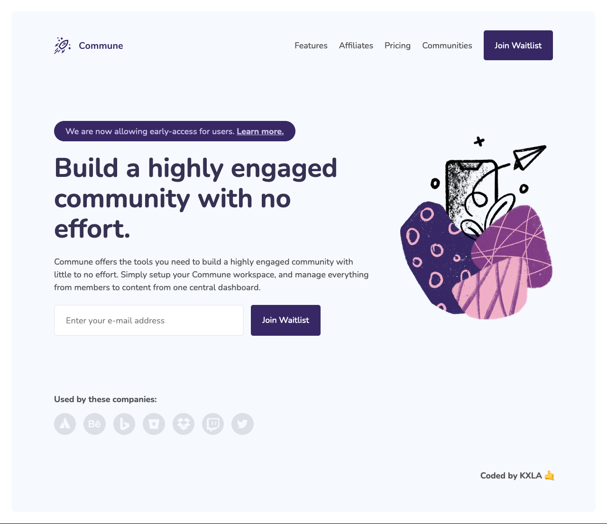

# Codewell - Commune Waitlist Page

This is a solution to the [Commune Waitlist Page](https://www.codewell.cc/challenges/commune-waitlist-page--608d9565747bad001532bd64). Codewell challenges help you Improve your HTML and CSS skills by practicing on real design templates.

## Table of contents

- [Overview](#overview)
  - [The challenge](#the-challenge)
  - [Screenshot](#screenshot)
  - [Links](#links)
- [My process](#my-process)
  - [Built with](#built-with)
  - [What I learned](#what-i-learned)
- [Author](#author)
- [Acknowledgments](#acknowledgments)

## Overview

### The challenge

Users should be able to:

- View the optimal layout for the site depending on their device's screen size

### Screenshot

### Links

- Solution URL: [Github Repo](https://github.com/KXLAA/CW-01-communie-waitlist)
- Live Site URL: [Live Preview](https://kxlaa.github.io/CW-01-communie-waitlist/)

## My process

### Built with

- Semantic HTML5 markup
- CSS custom properties
- Flexbox
- CSS Grid
- SCSS

### What I learned
This project was fairly straightforward, i was able to practice some CSS grid and Flexbox for the layout. I also used javascript to implement a mobile navigation. 

## Author

- Website - [KXLA 🤙](https://www.your-site.com)

